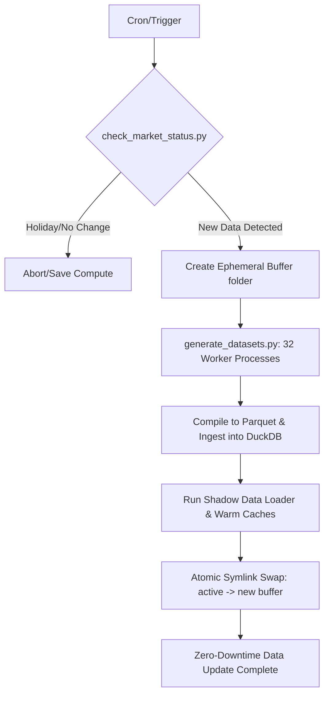

# Finugreek - The AI-Native Market Analytics Platform

Finugreek is a high-density, real-time quantitative research and portfolio analytics terminal designed to run on top of an AI-native execution agent. 

---

## Motivation & Core Philosophy

Finugreek was built to solve a personal portfolio management challenge: while an immense volume of market, fundamental, and quantitative factor data exists, it remains completely inaccessible through mainstream retail brokerage platforms (such as Groww or Zerodha). Retail interfaces prioritize simple transaction flows over institutional-grade analytics.

Finugreek bridges this gap by acting as a personal high-performance trading terminal, providing deep quantitative analytics, factor models, and real-time risk parameters on equity, ETF, mutual fund, and digital asset classes.

---

## AI-Native Agent Engine & LLM Integrations

Finugreek is built around a state-of-the-art **LangGraph agent execution engine**, which drives the interface natively. Rather than being a simple chat wrapper, the AI system is deeply embedded into the analytics workflow:

### 1. LangGraph Analytical State Graphs
* **Compiled Graph Runtimes**: The backend compiles dynamic, multi-agent state graphs (`graph.py` and `memo_graph.py`) to manage conversation memories, state transitions, and analytical execution paths.
* **Deterministic Structured Outputs (Pydantic)**: Uses OpenAI/Anthropic tool-calling to enforce Pydantic structural contracts (`TeardownResponse`, `FinalVerdict`, `TeardownSection`). This ensures that qualitative investment analyses ("teardowns") contain rigorous, deterministic classifications and convictions (0-10 scale) rather than vague text.
* **Dynamic Frontend Component Registry (UI Components)**: The agent can output an array of structured `UIComponent` objects. These components contain stringified JSON payloads that map to a registry of interactive React panels. The frontend deserializes these payloads and renders interactive grids, charts, or tables directly inline in the streaming chat interface.
* **Server-Sent Events (SSE)**: Streams intermediate agent thoughts, node transitions, and token generations to the frontend client in real-time.

### 2. Distilled High-Signal Context Injection
To maximize LLM signal and prevent token bloat, the engine compresses raw data before context injection:
* **Context Condensation**: Merges raw data from DuckDB and KDB+ into a consolidated JSON payload.
* **Key-Signals Extraction**: Extracts specific financial highlights (e.g. quarterly revenue trend), technical signals (RSI-normalized, SMA distances, Bollinger Volatility Squeezes), shareholding momentum vectors (promoter pledge changes, institutional accumulation), and health metrics (Piotroski F-score, Graham Number, Altman Z-Proxy).

---

## High-Performance & Quantitative Infrastructure

To support low-latency factor modeling and real-time visualization, the application's backend is split into two specialized database/ingestion layers:

### 1. Ultra-Low Latency Time-Series Layer (KDB+/Q)
* **Real-Time Tick Engine**: The system integrates **kdb+** and its vector programming language **q** to ingest, process, and store high-frequency order book and tick data.
* **WebSocket Pipelines**: Consumes real-time cryptocurrency feeds directly from **Binance WebSockets** and streams domestic equity tick changes using light WebSocket conduits.
* **Vectorized Calculations**: Factor computations, correlation matrices, and trajectory projections are processed natively in the database layer using vectorized operations, enabling sub-millisecond data retrieval.

### 2. High-Density Analytical OLAP Layer (DuckDB + Parquet)
* **Column-Store Layout**: Historical market datasets, factor exposures, and mutual fund holdings are stored as compressed, highly optimized **Parquet** files.
* **In-Process SQL Analytics**: Finugreek leverages **DuckDB** for lightning-fast, zero-copy OLAP queries against these Parquet files. DuckDB views (`stocks`, `etfs`, `mutual_funds`) enable complex multi-table joins and mathematical aggregations directly on the server without database server overhead.

---

## Data Pipeline & Ingestion Architecture

A custom, automated pipeline ([update_pipeline.py](file:///Users/rohith/groww/scripts/update_pipeline.py)) executes periodic data refreshes with institutional safety guarantees:



* **Holiday & Weekend Filtering**: The pipeline runs `check_market_status.py` first to check for trading day timestamp increments. If no change is detected (e.g., market holidays), the pipeline aborts to save compute resources.
* **Multi-Process Extraction**: Utilizes a Python multiprocessing pool spawning up to **32 concurrent workers** to extract, normalize, and process market metrics simultaneously.
* **Shadow Ingestion & Atomic Symlink Swap**: 
  - To prevent read-locks and database corruption, the data update runs in a newly created ephemeral directory (`datasets/run_YYYYMMDD_HHMMSS`).
  - Once the datasets are processed and compiled into `market_data.duckdb`, the pipeline runs a **shadow load** to verify integrity and pre-warm query caches.
  - The live system references database paths through a symbolic link (`datasets/active`). The pipeline performs an **atomic symlink swap** to instantly point to the new directory, ensuring zero-downtime updates and complete transactional isolation for active terminal users.

---

## Edge Infrastructure & Security (Cloudflare)

* **Cloudflare Tunnels**: Securely exposes backend endpoints and WebSocket channels to the client, removing the need for public inbound ports.
* **Low-Latency Edge Caching**: Configured with edge routing rules and caching headers, caching static data assets closest to the user's browser while bypassing cache rules dynamically for real-time WebSocket traffic.

---

## Technical Architecture & UI Implementation

The frontend client acts as a high-density dashboard visualization shell:
* **React & TypeScript**: Type-safe architecture with Vite for rapid Hot Module Replacement (HMR) and Rolldown-based production bundling.
* **Responsive Visualizations (Recharts)**: Custom SVG components rendering 1-year analyst trajectories (High, Mean, Low) and Live Price nodes, displaying percentage variations relative to current market prices.
* **Zustand & TanStack Query**: Manages UI state-sharing across layouts and implements query caching and automatic server sync for real-time widgets.

---

## Development Setup

### Setup Instructions

1. **Install Dependencies**:
   ```bash
   npm install
   ```

2. **Configure Environment Variables**:
   Create a `.env` file in the root of the frontend workspace:
   ```env
   VITE_API_URL=https://your-cloudflare-tunnel-or-local-ip/api
   ```

3. **Run Dev Server**:
   ```bash
   npm run dev
   ```

4. **Production Build**:
   ```bash
   npm run build
   ```
